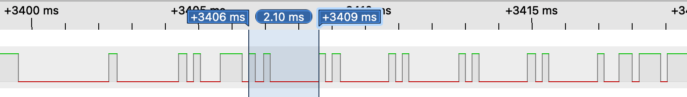

# How to open a safe

### TL;DR

A vulnerability allows opening electronic safes from the Sentry Safe and Master Lock company without any pin code.

The company was notified but never responded.

I created an alternative PCB and firmware to patch this issue, [available here](https://github.com/H4ckd4ddy/fix-sentry-safe)

### Story

I just bought a logic analyser, what can I do with it?


Look around... TV... printer... 

... electronic safe!


### Disassembly

Let's try to understand how it works.

Start by disassembling the door to take a look inside.

There are only two circuit boards:

- 1x outside with batteries, keypad, leds & buzzer
- 1x inside with memory & solenoid (who mechanically unlock the bolts)


### Capture

Between these two boards, there are 4 wires (black, yellow, green & red). As the color of wires are not always respected, let's assume that we don't trust them. We can inspect circuit tracks to find the wire mapping, but as my new logic analyser can cature 8 channels, let's just plug each wire in.

This kind of electronic safe needs a 5 digits code, so for the first cature I will just press the "1" key 5 times.


Result : only green wire has changing signal. Black is always low, yellow & red are always high (so colors are respected).

We can see on the captured signal 5 repetitions of the same shape in a row, so we can assume that matches our "1" key pressed 5 times.
To decode the full signal, we have to find the protocol used.

This safe is not open hardware or software, so we don't know how it works.

So let's take a look at the chips on boards.

Only one microcontroller on each of them.


According to the datasheet, main communication protocols used with this microcontroller are SPI and I²C.
But not this time, cause both of them need a clock signal, and there is no movement on any of the other wires.

So I guess it can be the most used asynchronous bus protocol: UART

Good news, the open source pulseview software contains a lot of decoders including UART.

But which frequency is being used?

To find out the frequency, I start by measuring time between each shape that we suppose to be a pressed key.



The whole key took 2.1 ms to be transmitted, and the shortest peak took approximatly 0.2 ms.
UART uses basically 1 start bit, 8 data bits & 1 stop bit = 10 bits

2.1 ms / 10 = 0.21 ms

This matches with our shortest peak.

10 bits in 2.1 ms
so
(1000 ms / 2.1 ms) * 10 = number of bits that can be transmitted in a second \~= 4762


UART frequency must match 9600 subdivision, 4762 is very close to 4800 wich match 9600/2, a common speed for UART.

So we try to set this frequency in our decoder.


It works! We can read our 5x "1" keys.

After some tries with different codes, here is some observations about different signal parts:

- signal always begins by a wake up shape with 2.7 ms low state, then 0.25ms high (not part of UART protocol)
- after wake up, signal always sends 0x0 byte
- after that, fixed value 0x71 is sent, it seems to be a command byte (0x71 = try an unlock)
- then 5 digits of the pressed code are sent
- finaly, the last byte changes depending on the code, it seems to be a custom checksum

Here is data :t 

| Command byte | Tried Code | Checksum byte |
|--------------|------------|---------------|
| 0x71         | 11111      | 0x76          |
| 0x71         | 22222      | 0x7B          |
| 0x71         | 12345      | 0x80          |

We can see that checksum corresponds to command byte added to each code byte.

Now we have all the information needed to automate this process with a short Arduino function.

```cpp
void send_command(int command, int a, int b, int c, int d, int e) {
  int checksum = (command + a + b + c + d + e);
  
  // Wake-up signal shape
  pinMode(pin, OUTPUT);
  digitalWrite(pin, LOW);
  delayMicroseconds(2750);
  digitalWrite(pin, HIGH);
  delayMicroseconds(200);

  // Data
  Serial.begin(4800);
  Serial.write(0x0);
  Serial.write(command);
  Serial.write(a);
  Serial.write(b);
  Serial.write(c);
  Serial.write(d);
  Serial.write(e);
  Serial.write(checksum);
  Serial.end();

  pinMode(pin, OUTPUT);
  digitalWrite(pin, HIGH);
}
```

But even if each code can be tried very fast, the safe contains bruteforce protection.

So I try to capture the signal during code change to see what append.

To change the code :
- Press the "P" button
- Enter the factory code
- Enter your new code


When we look at the signal :
- Some strange custom shapes are sent during "P" press
- Keypad board sends factory code with a 0x74 command byte
- The chip inside responds if factory code is valid or not (factory code is printed on manual, random and cannot be changed)
- Keypad send new code with 0x75 command byte

I also capture the signal exchange at boot time, so we can now map some functions :

| Command byte | Function                    | Code provided | Response if OK  | Response if error |
|--------------|-----------------------------|---------------|-----------------|-------------------|
| 0x71         | Try to unlock               | Code to try   | 0x51 1 0 1 0x53 | 0x51 0 0 1 0x52   |
| 0x72         | Init 2nd code change        | 1st code      | 0x52 1 0 1 0x54 | 0x52 0 0 1 0x53   |
| 0x74         | Init 1st code change        | Factory code  | 0x54 1 0 1 0x56 | 0x54 0 0 1 0x55   |
| 0x75         | Save 1st code               | New code      | 0x55 1 0 1 0x57 |                   |
| 0x76         | Save 2nd code               | New code      | 0x56 1 0 1 0x58 |                   |
| 0x78         | Boot                        | 00000 (null)  | 0x58 1 0 1 0x5A |                   |


After too many incorrect attempts, the middle byte in the response becomes 0x10, which triggers the keypad's anti-bruteforce lock for a few minutes.


But what happends if you directly send a new code signal, skiping factory code step...

... the code is overwritten !!! So we can reset code without knowing it.


We can now open every Sentry Safe & Master lock electronic safe in a second.

### Poc

As a Proof of Conncept, I will build a pocket tool.

I took an Atmega328, 8bits AVR microcontroller at 8 MHz (without crystal). After flashing the program to its flash, I solder on two CR2032 batteries, a button and two pins.

The program will just send a reset signal to set a dummy code, then send an unlock signal to open safe.

And I put all of this in a pen... to have a real pen-test tool.

🎉


How to use it :

- Remove tiny screw in front of safe
- Touch black and green wires with two pins of our pen
- Press button
- Safe is open !

### Demo


### Fix

To fix this vulnerability, [check my other repository](https://github.com/H4ckd4ddy/fix-sentry-safe)
